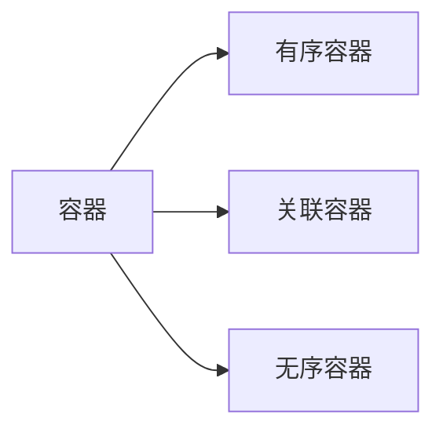
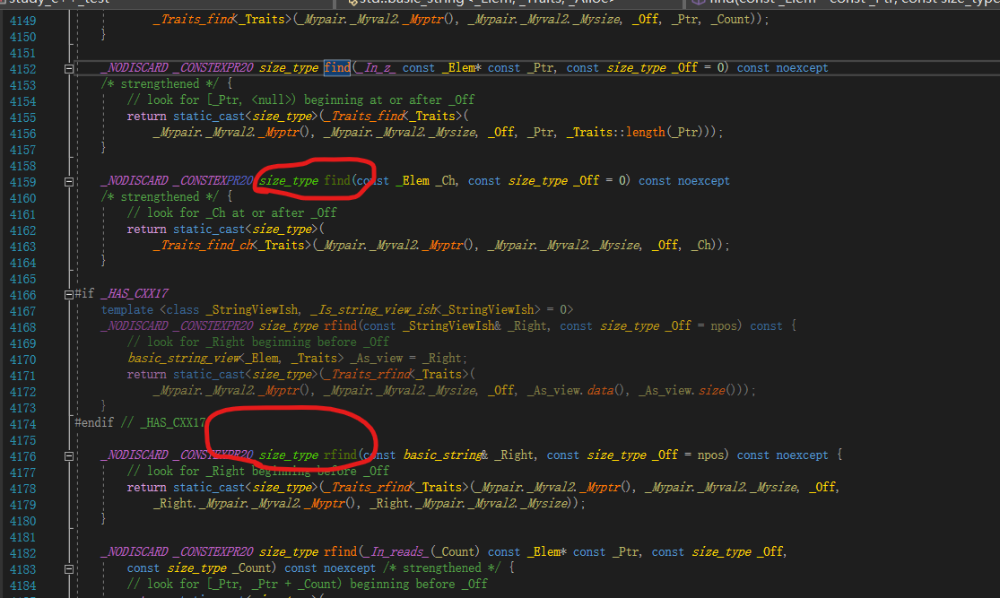

## 一、STL

### 1. 容器




#### 1.1 序容器

##### 1.1.1 顺序容器

> 所有顺序容器都提供了快速顺序访问元素的能力，但是这些容器在以下方面都有不同的性能折中。
>
> - 向容器中添加或者删除元素的代价
> - 非顺序访问容器中元素的代价

|    vector    | 可变数组，支持快速访问，在尾部之外插入或者删除删除元素慢     |
| :----------: | ------------------------------------------------------------ |
|    deque     | 双端队列，支持随机访问，在头尾位置插入删除很快               |
|     list     | 双向队列，只支持双向顺序访问，在list中任何位置尽心插入或者删除速度都很快； |
| forward_list | 单向链表，只支持单向顺序访问，在链表的任意位置进行插入或者删除操作速度都很快； |
|    array     | 固定大小，支持快速随机访问，不能添加或者删除元素；           |
|    string    | 与vector相似的容器，但专门用于保存字符，随机访问快，在尾部插入或者删除很快 |

### 2. 容器库

#### 2.1 通用容器操作

| 类型别名        | 解释                                                   |
| --------------- | ------------------------------------------------------ |
| iterator        | 此容器类型的迭代器类型                                 |
| const_iterator  | 可以读取元素，但是不能修改元素的迭代器类型             |
| size_type       | 无符号整型类型，足够保存此种容器类型最大可能容器的大小 |
| difference_type | 带符号类型，足够保存两个迭代器之间的距离               |
| value_type      | 元素类型                                               |
| reference       | 元素的左值类型；与value_type含义相同                   |
| const_reference | 元素的const左值类型（即const  value_type&）            |

### string

#### size_type

string对象的返回值类型，size_t（unsigned int）



```c++
find()
_NODISCARD _CONSTEXPR20 size_type find(const _Elem _Ch, const size_type _Off = 0) const noexcept
    /* strengthened */ {
        // look for _Ch at or after _Off
        return static_cast<size_type>(
            _Traits_find_ch<_Traits>(_Mypair._Myval2._Myptr(), _Mypair._Myval2._Mysize, _Off, _Ch));
    }
//size_type的类型定义
    using size_type       = typename _Alty_traits::size_type;
```


### using的使用

#### 概述

> using 有三种用法。
>
> - 命名空间的使用
> - 在子类中引用基类成员
> - 别名指定（多少有点迷糊）

#### 1、命名空间

```c++
//表示使用某命名空间
namespace test；

//使用某命名空间
using namespace test；
```

#### 2、子类中引用基类成员

```c++

class T5Base {
public:
    T5Base() :value(55) {}
    virtual ~T5Base() {}
    void test1() 
    {
        cout << "T5Base test1..." << endl;
    }
protected:
    int value;
};
 
class T5Derived : private T5Base {
public:
    //using T5Base::test1; 成员函数(不确定)
    //using T5Base::value; 成员属性
    void test2() { cout << "value is " << value << endl; }
};
```

#### 3、别名指定

在c++11中提出了通过using指定别名

```c++
//使用typedef 
typedef std::unique_ptr<std::unordered_map<std::string, std::string>> UPtrMapSS;
//c++11
using UPtrMapSS = std::unique_ptr<std::unordered_map<std::string, std::string>>;
```

### typename

> 在泛型编程中用于引入模板参数
>
> - 此时typename与class一致，表名后面为一种类型