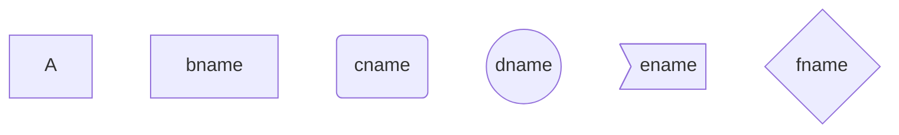

### 1、代码块

```java
java code block
//代码块语法
```(语言)
```java
```shell
```Python
```

### 2、标题

```shell
//标题语法
# 一级标题
## 二级标题
### 三级标题
#### 四级标题
```

效果如下：

# 一级标题

## 二级标题
### 三级标题
#### 四级标题

### 3、字体

```java
//加粗
**等不到天黑**
//高亮显示
==我不是药神==
//删除线
 ~~被删除的内容~~
//斜体
*斜体内容*
```

效果如下

//加粗
**等不到天黑**
//高亮显示
==我不是药神==
//删除线
 ~~被删除的内容~~
//斜体
*斜体内容*

### 4、引用

``` java
//引用语法
>作者：note
>>作者：note
>>>作者：note
```

效果如下

>作者：note
>>作者：note
>>
>>>作者：note

### 5、分割线

```java
//分割线1
---
//分割线2
***
```

效果如下

***

---

### 6、图片

```java
//在线图片/本地图片
---图片路径（括号内为路径）
```

### 7、超链接

``` java
//超链接
[我的github](地址)
```

### 8、列表

``` java
//无序列表
- 目录1
- 目录2
- 目录3
```

效果如下：

- 目录
- 目录2
- 目录3

###  9、表格

|      |      |      |
| ---- | ---- | ---- |
|      |      |      |
|      |      |      |
|      |      |      |

（建议快捷生成）

### 10、流程图


> markdown是轻量级的文本编辑器，mermaid画图时不能同时从上到下，又从左到右；

> - 节点名不能与关键字同名
> - 使用引号可以避免不必要的麻烦，如避免与关键字同名

#### 10.1 图方向

- TB，从上到下
- TD，从上到下
- BT，从下到上
- RL，从右到左
- LR， 从左到右

例如：


####  10.2 节点形状

> 节点的形状不同

- 默认节点A
- 文本节点B[bname]
- 圆角节点C（cname）
- 圆形节点D（（dname））
- 非对称节点E>ename]
- 菱形节点P{fname}



#### 10.3 连线类型

> 节点之间的连线也有不同的方式，可以在连线中添加标签

- 箭头连接 A1-->B1
- 开放连接 A2-->B2
- 标签连接 A3-text-B3
- 箭头标签连接 A4-text->B4
- 虚线开放连接 A5.-B5
- 虚线箭头连接A6-.->B6
- 标签虚线连接A7-.text->B8
- 粗线开放连接A9===B9
- 粗线箭头连接A10==>B10
- 标签粗线开放连接A11== text ==B11
- 标签粗箭头连接A12== text ==>B12 


#### 子图（subgraph）


#### 序列图

- participant

  参与者，相当于定义模块，可通过设定参与者（participant）的顺序控制展示顺序；

  如下：

  ```sequence
    participant A 
    participant B 
  ```

  ```sequence
  participant B
  participant A
  ```

  ##### ==使用别名==

  ```sequence
  participant A as Dog
  participant B as Cat
  
  Dog->Cat:hello
  ```

  ##### ==note==(注释)

  - 

  ```sequence
  participant A
  participant B
  note right of A:Text
  note  left of A:test
  ```

  ##### ==循环==

  - 示例有问题

  ```sequence
  loop 
  
  end
  ```

  


