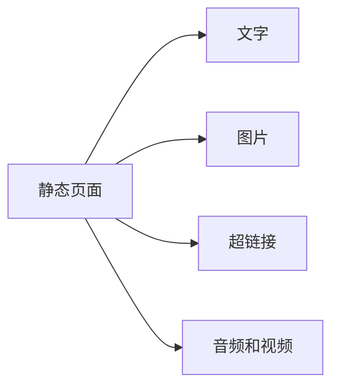
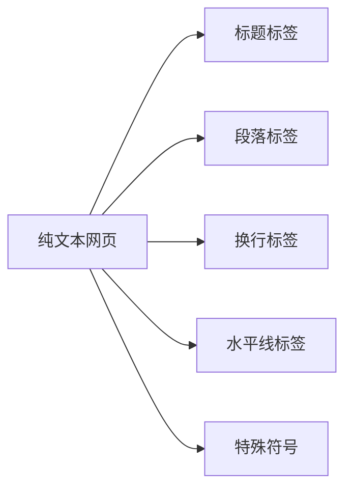
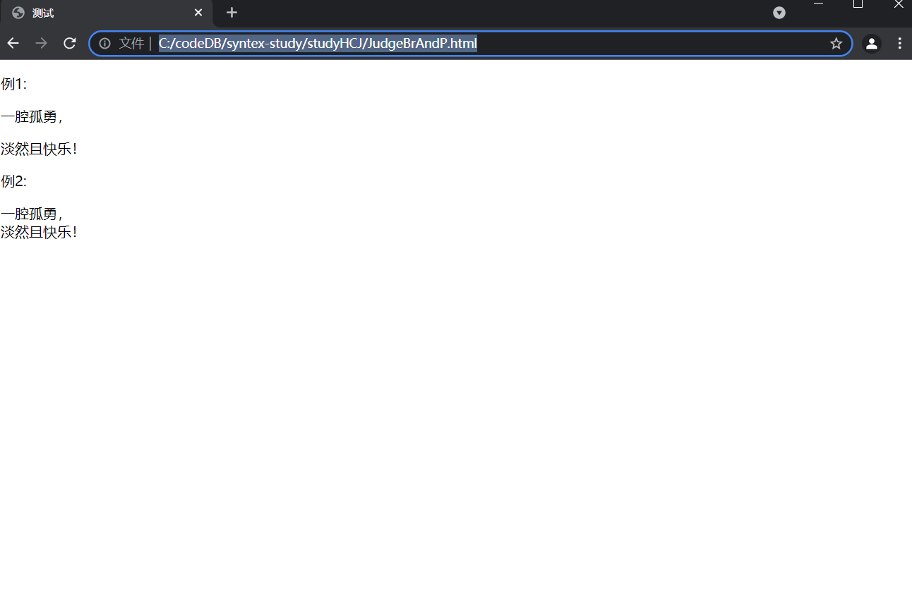

# HTML从入门到入土

## 一、基本标签

### 1.1 html结构

```html
<!DOCTYPE html>    <!--文档声明-->
<html>
    <head>			<!--页头-->
    </head>
    <body>			<!--页身-->
    </body>
</html>
```

#### 1.1.1 文档声明

- <!DOCTYPE html>   表示该文档一个html页面

#### 1.1.2 html标签

> 标志着着呢提页面的开始和结束
>
> 在实际开发中会有下面这一行代码
>
> 说明当前页面符号W3C的html标准

```html
<html xmlns="http://www.w3.org/1999/xhtml">
```

#### 1.1.3 head 标签

- 表示网页的头部
- 用于定义特殊的内容：页面标题、定时刷新、外部文件等
- 页面的标题 <tiltle></title>
- 段落标签 <p></p>
- 能放在head标签中的标签：title、meta、link、style、script、base

#### 1.1.4 body标签

- 网页的主要内容（大部分内容在该标签中）

#### 1.1.5 head下常用标签

##### 1.1.51 title标签

- titile标签的唯一作用就是给页面添加标题


##### 1.1.52 meta标签

- meta标签一般用于定义页面的特殊信息
- 例如：页面关键字，页面描述；
- 该信息是提供给搜索引擎看的，说明该页面的大概主题；

###### 1、name属性

> - name属性
>
> | 属性值      | 说明                                     |
> | ----------- | ---------------------------------------- |
> | keywords    | 网页的关键字，可以是多个，而不仅仅是一个 |
> | description | 页面的描述                               |
> | author      | 网页的作者                               |
> | copyright   | 版权信息                                 |

```html
<!DOCTYPE html>
<html>
    <head>
        <title>NoteSir博客园</title>

        <!--网页关键字-->
        <meta name="keywords" content="学习前端开发笔记">

        <!--网页描述-->
        <meta name="description" content="记录学习的点点滴滴">

        <!--本页作者-->
        <meta name="author" content="NoteSir">

        <!--版权声明-->
        <meta name="copyright" content="本站所有内容均为原创，禁止转载！">
    </head>
    <body>
        <p>知识的味道</p>
    </body>
</html>
```

###### 2、http_equiv属性

> - http-equiv属性
> - 作用：1、定义网页所用的编码；2、定义网页自动刷新跳转；

```html
 <!--定义页面编码(h5标准)-->
 <meta charset="utf-8"> <!--一定要放在title以及其他meta标签前面-->

<!--自动刷新跳转的界面-->
<meta http-equiv="refresh" content="6;url=http://www.baidu.com">
```

##### 1.1.53 style标签

> - 用于定义元素的css样式

``` html
<!DOCTYPE html>
<html>
    <head>
        <title>NoteSir博客园</title>
        <style type=''>
        /*这里写css样式*/
        </style>
    </head>
    <body>
        <p>知识的味道</p>
    </body>
</html>
```

##### 1.1.54 script标签

> - 用于定于页面的JavaScript代码

``` html
<!DOCTYPE html>
<html>
    <head>
        <title>NoteSir博客园</title>
        <script>
        /*这里写javascript代码*/
        </script>
    </head>
    <body>
        <p>知识的味道</p>
    </body>
</html>
```

##### 1.1.55 link标签

> - link 标签用于引入外部样式文件（css文件）

``` html
<!DOCTYPE html>
<html>
    <head>
        <title>NoteSir博客园</title>
        <link type="text/css" rel="stylesheet" herf="css/index.css">
    </head>
    <body>
        <p>知识的味道</p>
    </body>
</html>
```

##### 1.1.56 base标签

> 这个标签暂时没有意义，以后慢慢了解原因；

#### 1.1.6 HTML注释

``` html
<!--注释文本-->
```

## 二、文本

### 2.1 文本简介

#### 2.1.1 页面组成元素

> 页面存在静态与动态的区分，这里主要考虑静态网页；
>
> - 静态与动态页面的区别在于后端技术与js（是否与服务器交互）



#### 2.1.2 HTML文本

主要包括以下内容：



### 2.2标题标签

> 在html中共有六个级别的标题标签：h1,h2......h6，从h1到h6重要性递减；
>
> - 一个页面一般只能有一个h1标签，h2~h6标签可以有多个；
> - 看似简单，其实影响搜索引擎优化；

``` html
<!DOCTYPE html>
<html>
    <head>
        <title>NoteSir博客园</title>
    </head>
    <body>
        <h1>一级</h1>
        <h2>二级</h2>
        <p>知识的味道</p>
    </body>
</html>
```

### 2.3 段落标签

#### 2.3.1 段落标签

- <p></p>用来显示一段文字

#### 2.3.2 换行标签

- </br>
- 随意对文字进行换行处理；

```html
<!DOCTYPE html>
<html>
    <head>
        <title>测试</title>
    </head>
    
    <body>
        <p>例1:</p>
        <p>一腔孤勇，</p>
        <p>淡然且快乐！</p>
        <p>例2:</p>
        <p>一腔孤勇，</br>淡然且快乐！</p>
    </body>
</html>
```
- br与p标签之间的区别：
  

### 2.4 文本标签

> 使用文本标签来对文字进行修饰，例如粗体、斜体、上标、下标等。常用的标签有八种：
>
> - 粗体：strong、b
> - 斜体标签：i、em、cite
> - 上标标签：sup
> - 下标标签：sub
> - 中划线：s
> - 下划线：u
> - 打字号标签：big
> - 小字号标签：small
>
> 水平线标签：<hr/>

```html
<!DOCTYPE html>

<html>
    <head>
        <title>测试修饰文本的标签</title>>    
        
        <meta charset="utf-8">
    </head>>    
    
    <body>
        <p>普通文本</p>>
        
        <!--加粗-->
        <strong>这是加粗的文本</strong>
        <b>这也是加粗文本</b>

        <!--斜体标签-->
        <i>斜体文本</i>
        <em>2斜体文本</em>
        <cite>3斜体文本</cite> 
        
        <!--上标签-->
        <p>(a+b)<sup>2</sup>=a<sup>2</sup>+2ab+b<sup>2</sup></p>

        <!--下标签-->
        <p>H<sub>2</sub>SO<sub>4</sub>指的是硫酸分子</p>

        <!--中划线-->
        <p><s>原价：￥6.5/kg</s></p>

        <!--下划线-->
        <p><u>notesir</u>最强</p>

        <!--大字号标签 小字号标签-->
        <big>大字</big><br/>
        <small>小字</small>

        <!--水平线-->
        <p>线上活动</p>
        <hr/>
        <p></p>线下活动</p>

    </body>
</html>
```


### 2.5 div标签

> 使用div标签来划分HTML结构，从而配合CSS来“整体”控制某一块样式。
>
> - 在有有div包着和没有该标签，在预览的效果是是一致的；

### 2.6 自闭合标签

> 标签分为两种：一般标签和自闭合标签.
>
> - 一般标签：有开始和结束标签，在两个标签之间可以插入内容；
> - 自闭合标签：只有开始符号，其内部不可插入内容；

| 标签     | 说明                             |
| -------- | -------------------------------- |
| <meta/>  | 定义网页的信息（供搜索引擎查看） |
| <link/>  | 引入外部的css文件                |
| <br/>    | 换行                             |
| <hr/>    | 水平线标签                       |
|    | 图片标签                         |
| <input/> | 表单标签                         |

  ### 2.7 块元素和行内元素

> 标签又称“元素”，根据表现形式不同一般可以分成两类：块元素（block）和行内元素（inline）

#### 2.7.1 块元素

> 块元素在显示的状态下占据一整行，并排斥其他元素位于同一行；
>
> 此外，一般情况下，块元素内可以容纳其他块元素和行内元素；

| 块元素 | 说 明    |
| ------ | -------- |
| h1～h6 | 标题元素 |
| p      | 段落元素 |
| div    | div元素  |
| hr     | 水平线   |
| ol     | 有序列表 |
| ul     | 无序列表 |

#### 2.7.2行内元素

> 行内元素可以与其他行内元素位于同一行，行内元素内部（标签内部）可以容纳其他行内元素，不可以容纳块元素；

| 行内元素 | 说 明                           |
| -------- | ------------------------------- |
| strong   | 粗体元素                        |
| em       | 斜体元素                        |
| a        | 超链接                          |
| span     | 常用的行内元素，结合css定义样式 |

### 2.8 特殊符号

#### 2.8.1 网页中的“空格”

> 想让段落的首行缩进两个字符的距离，而在html中的缩进也是由代码实现的，空格的代码为&nbsp；

#### 2.8.2 网页中的“特殊符号”

## 二、列表

 
