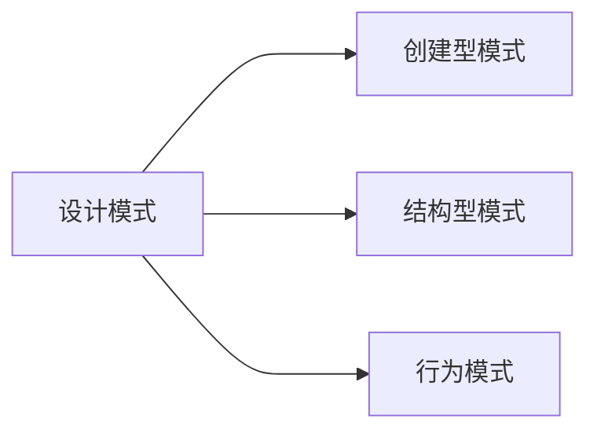
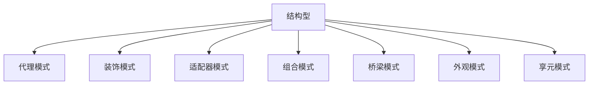
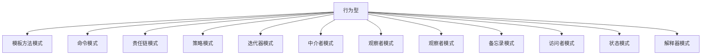

# 设计模式 

## 前言



> - 概念
>   - 高内聚：
>   - 低耦合：

## 概要

### 1 .   创建型

>创建模式的作用可以概括为以下两点：
>
>- 封装创建逻辑
>- 封装创建逻辑变化。客户代码尽量不修改，或者尽量少修改。

 ```mermaid
 graph TB
 A[创建型]-->B[单例模式]
 A-->C[工厂方法模式]
 C-->E[工厂方法]
 C-->F[抽象工厂方法]
 A-->D[建造者模式]
 A-->G[原型模式]
 ```


常见的创建设置模式：

1. **单例模式：**一个类只有一个实例，自行实例化并向整个系统提供该实例。
2. **工厂方法模式：**工厂为抽象类，实际的创建工作一般由子类实现。**工厂方法的用意**是定义一个创建产品对象的工厂接口，将实际创建工作推迟到子类中，强调的是**“单个对象”的变化**。
3. **抽象工厂模式：**抽象工厂是所有工厂模式中最为抽象的和最具一般性的一种形态。抽象工厂向客户提供一个接口，使得客户在不必指定产品具体类型的情况下，创建多个产品族中的产品对象，强调的是**“系列对象”的变化**。
4. **建造者模式**：把构造对象的逻辑移到类的外面，在类的外部定义了该类的构造逻辑。把一个复杂对象的构造过程从对象的表示中分离出来，其直接效果是将一个复杂的对象简化为一个比较简单的目标对象，强调的是**产品构造的过程**。
5. **原型模式**：隐藏了对象的创建过程。通过复制一个现有的对象生成新对象。

### 2.  结构型

>- **关注点**：类和对象的结构问题
>- **方式**：
>  1. 采用继承机制来组合接口或者实现（类结构型模式）
>  2. 通过组合一些对象实现的新功能（对象结构型模式）



1. **代理模式：**为其他对象提供一种代理以控制对该对象的访问；
2. **装饰模式：**动态地给一个对象添加一些额外的职责。就增加功能来说，装饰模式比生成子类更加灵活。
3. **适配器模式：**将一个类的接口变换为客户端所期待的另一接口，从而使原本因接口不匹配而无法在一起工作的两个类能够在一起工作。
4. **组合模式：**将对象组合成树形结构以表示“部分-整体”的层次结构，使得用户对单个对象和组合对象的使用具有一致性。
5. **桥梁模式：**将抽象与实现解耦，使得两者可以独立变化。
6. **外观模式：**要求一个子系统与其内部的通信必须通过一个统一的对象进行。提供了一个高层次的接口，使得子系统更易于使用。
7. **享元模式：**池技术的重要实现方式，使用共享对象可有效地支持大量的细粒度的对象。

### 3. 行为型

> - **关注点**：对象的行为
> - **作用**：解决对象之间的联系问题



1. **模板方法模式**：定义一个操作中的算法的框架，而将一些步骤延迟到子类中，是得子类可以不改变一个算法结构即可重定义该算法的某些特定步骤；
2. **命令模式**：一种**高内聚**的模式。将一个请求封装成一个对象，从而使用不同的请求把客户端参数化，对请求排队或者记录请求日志，可以提供命令撤销和恢复功能。
3. **责任链模式**：

## 一、创建型模式

### 1.1 Factory模式（工厂模式）

> 工厂模式的两个重要功能：
>
> - 定义创建对象的接口，封装对象的创建；
> - 使得具体化类的工作延迟到了子类中。

**Q:使用工厂模式的应用场景是什么？**


### 1.2 Abstract Factory模式（抽象工厂模式）


### 1.3 Singleton模式（单例模式）


### 1.4 Builder模式（建造者模式）


### 1.5 Prototype模式

